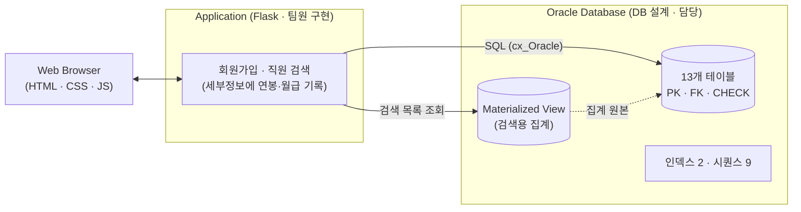
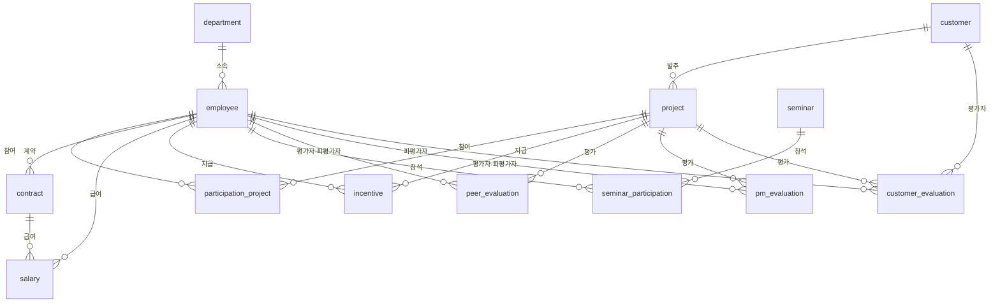

# 🏢 Oracle EMS: 사원 관리 시스템 데이터베이스 설계

## 🌟 프로젝트 소개
**Oracle EMS**는 100명 규모 SI 업체의 사원·부서·프로젝트 참여·계약·급여·평가 정보를 관리하는 **Oracle 기반 사원 관리 시스템**입니다. 데이터베이스 설계 수업의 4인 팀 프로젝트로, 요구사항 분석부터 ERD, 표준 정의, DDL, 시드 데이터 적재까지 진행했습니다.

핵심은 **데이터 모델링과 DB 단 무결성**입니다. 13개 테이블에 PK·FK·CHECK 제약을 걸어 잘못된 데이터가 DB에 들어오지 않게 했고, "참여 인원은 언제든 바뀔 수 있다"는 요구를 **참여 이력 테이블과 종료일 기록**으로 풀어 특정 시점의 참여 현황을 조회할 수 있게 설계했습니다.

| 항목 | 내용 |
| :--- | :--- |
| **개발 기간** | 2024-09 ~ 2024-12 (데이터베이스 설계 수업, 4인 팀) · 2026-09 ~ 2026-10 보안 리팩토링 |
| **담당 범위** | DB 설계 (DDL, 제약조건, 이력 관리, Materialized View·인덱스·시퀀스) · DB 관리 스크립트 |
| **팀원 담당** | DB 설계(팀원 1명이 함께 설계), 웹 애플리케이션(Flask), 시드 데이터 생성 스크립트 |

---

## 🎯 My Key Contributions
요구사항을 정규화된 데이터 구조로 옮기고, 그 구조가 DB 단에서 스스로 데이터를 지키도록 만드는 데 집중했습니다.

* **데이터 모델링:** 요구사항(직원 100명, 개발자 70명, 프로젝트 참여·평가·계약·급여)을 **최종 13개 테이블**로 설계 (팀원 1명과 함께 설계, 3정규형을 기준으로 한 **부분 정규화**, 일부는 반정규화)
* **DB 단 무결성:** **PK 13 · FK 20 · CHECK 8 · UNIQUE 1** 제약으로 날짜 순서·직무 값·평가 유형·동료평가 점수 범위를 강제
* **시점별 이력 관리:** 참여 이력(시작일·종료일·직무)을 별도 테이블로 두고, 끝난 참여는 삭제하지 않고 종료일을 기록
* **검색을 위한 객체:** 사원 검색용 집계 Materialized View 1개, 인덱스 2개, 시퀀스 9개

---

## 🛠 기술 스택 (Tech Stack)

### **Database (담당)**
* **DBMS:** Oracle Database 19c
* **Language:** SQL (DDL, DML)
* **Modeling:** DA# (ERD, IE/Crow's foot 표기), SQL Developer
* **Security (2026 리팩토링):** Python `cryptography` (AES-256-GCM), `werkzeug.security` (scrypt 해시)

### **Application (Team)**
* **Backend / Web:** Python, Flask (서버 사이드 렌더링)
* **DB Driver:** cx_Oracle, Oracle Instant Client

---

## 🚀 주요 기능

### 📚 데이터 표준화
* 표준 용어·도메인(타입과 길이)·공통 코드(부서 구분 등)를 정의해 컬럼명과 데이터 타입을 맞췄습니다. 이 정의서는 수업의 구축 단계(11/18) 산출물로 제출했습니다.
* 도메인은 DDL에 그대로 반영했습니다 (예: 직원명 `VARCHAR2(30)`, 이메일 `VARCHAR2(50)`, 전화번호 `VARCHAR2(20)`, 프로젝트명 `VARCHAR2(100)`).

### 🔒 DB 단 무결성
* 애플리케이션 검증에만 의존하지 않고 DB가 직접 규칙을 강제합니다. (아래 [제약과 검증](#-제약과-검증) 참고)

### 🕓 시점별 이력 관리
* 프로젝트 참여는 시작일·종료일·직무를 가진 이력 테이블로 관리하고, 계약과 급여도 이와 마찬가지로 계약일·급여일별로 **행을 쌓아 이력을 보존**합니다.

### ⚡ 검색 지원 (Materialized View · 인덱스)
* 사원·부서·연락처와 현재 진행 중인 참여 수를 미리 집계한 **검색용 Materialized View**와, 이름·부서명 **인덱스**를 제공합니다.

### 👤 회원가입을 위한 로그인 ID
* 로그인 ID(`username`, UNIQUE)와 비밀번호 컬럼, 사번 자동 부여용 시퀀스를 두어 회원가입 시 ID 중복 검사와 사번 자동 부여가 가능하게 했습니다.

---

## 🏗 시스템 구성
웹 애플리케이션은 3계층(브라우저 · Flask · Oracle)으로 구성했고, 이 저장소는 그중 **데이터 계층(Oracle)** 의 설계와 스크립트를 중심으로 합니다.



### ERD (13개 테이블)


| 영역 | 테이블 | 설명 |
| :--- | :--- | :--- |
| 조직 | `department`, `employee` | 부서 7종(CHECK), 직원(로그인 ID·학력·스킬셋 포함) |
| 프로젝트 | `customer`, `project`, `participation_project` | 발주처, 프로젝트(시작·종료일), **참여 이력(시작·종료일·직무)** |
| 계약·급여 | `contract`, `salary`, `incentive` | 계약(연봉), 월별 급여(기본급·월급), 프로젝트별 인센티브 |
| 평가 | `peer_evaluation`, `pm_evaluation`, `customer_evaluation` | 동료·PM·고객 평가 (평가 항목: 업무 수행 / 커뮤니케이션) |
| 교육 | `seminar`, `seminar_participation` | 세미나와 직원별 참석 |

---

## 🧱 데이터 모델 Deep Dive

### **정규화와 반정규화**
**3정규형을 기준으로 설계를 시작했고, 결과적으로는 부분 정규화입니다.** 테이블 수는 **설계 단계 ERD 14개 엔터티 → 구축 초기 DDL 16개 테이블 → 최종 13개 테이블**로 바뀌었습니다. 설계 단계에서는 경험 기술(`경험기술`)을 별도 엔터티로 두었고, 구축 초기 DDL에서는 평가 항목도 별도 테이블(`*_type`)이었습니다. 구축 과정에서 조회와 구현을 단순하게 하려고 일부를 반정규화했고, 최종 13개 테이블 중 **11개는 3정규형을 충족하며 `employee`와 `salary` 두 곳이 예외**입니다. 반정규화가 적용된 곳은 다음과 같습니다.

| 테이블 | 반정규화 내용 | 이유 | 정규형 영향 |
| :--- | :--- | :--- | :--- |
| `salary` | 기본급(`base_salary`)·월급(`monthly_salary`)을 계산 가능한 값이지만 저장 | 급여 **지급 내역의 증빙 자료**로 쓰기 위해, 지급 시점의 값을 그대로 보존 | 3정규형 위반 (계약연봉/12로 유도 가능한 값) |
| `salary` | `employee_id`를 중복 저장 (계약을 통해서도 알 수 있음) | 직원 기준 급여 조회를 계약 테이블을 거치지 않고 직원과 바로 조인하기 위함 | 3정규형 위반 (`salary_id → contract_id → employee_id`) |
| `employee` | 기술 목록(`skill_set`)을 쉼표로 이은 문자열 한 컬럼에 저장 | 보유 기술은 한 컬럼에 문자열로 이어 두면, 기술이 늘어날 때 그 칸에 덧붙여 저장하면 되어 관리가 단순함 | 1정규형 위반 (한 칸에 여러 값) |
| `peer_` / `pm_` / `customer_evaluation` | 평가 항목(`*_type`) 테이블을 본 테이블에 **병합** (`evaluation_type`, `evaluation_content`) | 평가를 항목 테이블로 나누면 조회할 때마다 조인이 필요함. 합쳐서 조인 없이 한 번에 조회하도록 단순화 | 정규형은 유지 (항목별 평점을 줄 수 있음). 대신 같은 (프로젝트, 평가자, 피평가자)에 항목별 2행이 생겨 키 컬럼이 반복됨 |

### **시점별 참여 이력 설계**

**Challenge**
요구사항 정의서에 "참여 인원은 언제든 바뀔 수 있다", "특정 시점에 어떤 직원이 어떤 프로젝트, 어떤 직무에 참여했는지 알 수 있어야 한다"가 있었습니다. 직원 테이블에 현재 값만 두면 변동 이전 기록이 남지 않아 특정 시점의 참여 현황을 조회할 수 없습니다.

**Solution**
프로젝트 참여 이력을 `participation_project` 테이블로 분리하고 **시작일·종료일·직무(role)** 를 기록했습니다. 참여가 끝나도 행을 삭제하지 않고 종료일을 채우는 방식으로 설계했고(CRUD 매트릭스에서 참여 종료는 수정 연산), 종료일이 비어 있으면 현재 진행 중인 참여입니다.

* `CHECK (end_date >= start_date)`: 종료일이 시작일보다 앞선 이력은 DB가 거부합니다.
* `CHECK (role IN ('PM','PL','Analyst','Designer','Programmer','Tester','other'))`: 직무 값을 제한합니다.

**특정 시점 조회 (예시)**
```sql
-- 2024-06-30 시점에 참여 중이던 직원·프로젝트·직무
SELECT e.employee_name, p.project_name, pp.role
FROM participation_project pp
JOIN employee e ON e.employee_id = pp.employee_id
JOIN project  p ON p.project_id  = pp.project_id
WHERE pp.start_date <= DATE '2024-06-30'
  AND (pp.end_date IS NULL OR pp.end_date >= DATE '2024-06-30');
```
시드 데이터에 같은 조건을 적용하면 2024-06-30 기준 참여 중인 이력은 14건(9개 프로젝트)입니다.

### **검색용 집계: Materialized View**
직원 검색 목록이 매번 `employee` · `department` · `participation_project` 세 테이블을 조인하고 집계하지 않도록, 결과를 `employee_search_mv`로 미리 만들어 두었습니다. **검색 목록용 집계**입니다. 집계하는 값은 현재 진행 중인 참여 수 통계(`COUNT`) 한 가지이고, 직원 검색 목록 화면에 표시하는 대시보드(직원 검색 목록의 집계 컬럼) 용도입니다. 별도의 통계·대시보드 화면은 없습니다.

| 컬럼 | 설명 |
| :--- | :--- |
| `employee_id`, `username`, `employee_name` | 직원 식별·이름 |
| `department_name` | 부서명 (`department`와 조인) |
| `employee_phone_number`, `employee_email` | 연락처 |
| `current_projects` | 현재 진행 중인 참여 수 (`end_date IS NULL`인 참여를 `COUNT`) |

### **인덱스**
`idx_employee_name`(직원명), `idx_department_name`(부서명) 두 개를 만들었습니다. 현재 동적 검색 SQL은 Materialized View에 `LIKE '%검색어%'`로 조건을 걸기 때문에 이 인덱스를 **실제로 사용하지는 않습니다.** 대신 `employee`와 `department`를 직접 조회하며 이름·부서명을 일치(`=`) 또는 앞부분 일치 조건으로 쓰는 SQL을 작성할 때는 사용할 수 있도록 만들어 두었습니다. (`department`는 7행이라 부서명 인덱스의 효과는 작습니다.)

---

## 🧪 제약과 검증

### 제약 목록
| 규칙 | 적용 테이블 | 제약 |
| :--- | :--- | :--- |
| 종료일 ≥ 시작일 | `project`, `participation_project` | `CHECK (end_date >= start_date)` |
| 직무 값 제한 | `participation_project` | `CHECK (role IN (...))` |
| 부서명 값 제한 | `department` | `CHECK (department_name IN (...))` (마케팅·경영관리·연구개발·개발·인사·영업·디자인) |
| 평가 유형 제한 | 평가 3개 테이블 | `CHECK (evaluation_type IN ('업무 수행평가','커뮤니케이션 수행평가'))` |
| 점수 범위 | `peer_evaluation` | `CHECK (score BETWEEN 0 AND 10)` |
| 로그인 ID 중복 방지 | `employee` | `UNIQUE (username)` |
| 참조 무결성 | 전체 | PK 13개, FK 20개 (참조 중인 행은 삭제 불가) |

### 시드 데이터
시드 데이터는 팀원이 작성한 생성 스크립트(Faker 기반)의 출력으로, 모두 가상의 값입니다.

| 테이블 | 행 수 | 테이블 | 행 수 |
| :--- | ---: | :--- | ---: |
| `employee` | 100 (개발 70 · 그 외 6개 부서 각 5) | `contract` / `salary` | 485 / 4,520 |
| `customer` | 100 | `peer_evaluation` | 4,528 |
| `project` | 200 (진행 중 15) | `pm_evaluation` | 944 |
| `participation_project` | 700 | `customer_evaluation` | 1,300 |
| `seminar` / `seminar_participation` | 100 / 500 | `incentive` | 1 |

시드 전체를 확인한 결과, 모든 제약을 만족하며 DB가 강제하지 않는 규칙(참여 기간이 프로젝트 기간 안에 있음, 프로젝트마다 PM 1명, 동료평가는 같은 프로젝트 참여자끼리 등)도 지켜집니다.

---

## 🗓 개발 기간과 작업 구분

| 시기 | 내용 |
| :--- | :--- |
| **2024 수업 당시 (2024-09 ~ 2024-12)** | 수업 일정에 따라 단계별로 제출했습니다.<br>**분석(10/21)** 요구사항 정의서 · **설계(11/04)** ERD(DA#)와 테이블 정의서 · **구축(11/18)** 표준 용어·도메인·코드 정의서, CRUD 매트릭스, 테이블 생성·시드 적재 스크립트와 증빙 · **최종(12/02)** 최종 보고서와 전체 시스템.<br>구축 단계의 DDL에서 최종 단계로 넘어가며 시퀀스, 로그인 컬럼, Materialized View, 인덱스를 추가하고 평가 항목 테이블을 본 테이블에 병합했으며, DROP/TRUNCATE 스크립트를 작성했습니다. |
| **2026-09 ~ 2026-10** | 보안 관련 리팩토링. 비밀번호 scrypt 해시, 주민등록번호 AES-256-GCM 암호화(키는 환경변수)와 화면 마스킹, 기존 평문 데이터 전환 스크립트, DB 접속 정보 환경변수화. 암호문을 담기 위해 `registration_number`를 `VARCHAR2(14)`에서 `VARCHAR2(100)`으로 확장<br>테스트를 쉽게 하기 위한 예시 쿼리 파일 추가(`sql/reference/example_queries.sql`) |

---

## 💡 회고 및 한계

참여 이력 PK가 (사원, 프로젝트)라 같은 프로젝트에 다시 투입되면 한 행으로만 남는 한계가 있습니다.
Materialized View 갱신 전략, LIKE '%...%'  검색이 인덱스를 쓰지 못하는 점은 이후 학습으로 알게 됐습니다.
2026.09 코드를 다시 점검하다 비밀번호·주민등록번호가 평문으로 저장되는 것을 발견해 고쳤습니다. 비밀번호는 scrypt 해시,
주민등록번호는 AES-256-GCM 암호화(키는 환경변수로 분리)와 화면 마스킹을 적용하고, 기존 평문 데이터를 바꾸는 전환 스크립트를
작성했습니다.

**그 밖의 한계**
* 참여 기간이 프로젝트 기간 안에 있어야 한다는 규칙은 DDL 주석에만 있고 제약으로 구현하지 못했습니다.
* 점수 CHECK는 `peer_evaluation`에만 있고, `pm_evaluation`·`customer_evaluation`에는 없습니다.
* 로그인·권한 기능은 구현하지 않았습니다. "경영진만 타 직원을 검색한다"는 요구는 시연에서 구두로 설명했습니다.

---

## 🔭 향후 개선
* **점수 제약 통일:** PM·고객 평가에도 점수 범위 CHECK 적용 (정의서의 "1~10점"과 CHECK 범위 맞춤)
* **평가 중복 방지:** (프로젝트, 평가자, 피평가자, 평가 유형)에 UNIQUE 제약 추가
* **참여 기간 제약:** 참여 기간이 프로젝트 기간 안에 있도록 트리거로 구현
* **기술 목록 분리:** `skill_set`을 직원-기술 분리 테이블로 정규화
* **급여 테이블 정리:** `salary.employee_id` 중복 제거 또는 복합 FK로 일치 강제
* **민감정보 저장 개선:** 비밀번호·주민등록번호 평문 저장 → **개선 완료** (2026-09)

---

## 🎥 발표와 결과물
* **최종 발표:** DB를 직접 열어 데이터와 조회가 가능한지 보여주는 방식으로 시연했습니다.
* **팀 웹 애플리케이션:** 직원 검색(이름·부서·직급·전화·이메일 중 하나 이상) → 세부정보에서 학력·스킬셋·현재 연봉·당해년도 월급 기록을 확인하고, 회원가입 화면에서 직원 정보를 등록·수정합니다.

---

## 👥 팀 소개 (Team)
| 역할 | 담당 |
| :--- | :--- |
| **팀장 · 데이터베이스 설계 (SQL)** | 데이터 모델링, DDL·제약조건, 이력 관리 설계, Materialized View·인덱스·시퀀스, DROP/TRUNCATE 스크립트 |
| **웹 애플리케이션 (Flask)** | 회원가입·직원 검색 화면(세부정보에서 연봉·월급 기록 확인)과 DB 연동 |
| **시드 데이터 생성** | Faker 기반 더미 데이터 생성 스크립트 |
| **데이터베이스 설계 (공동)** | 데이터 모델링과 테이블 설계를 팀장과 함께 진행 |

---

## ⚙️ 실행 방법

**요구 사항:** Python 3.12, Oracle Database, Oracle Instant Client

1. **Oracle Instant Client:** [Oracle Instant Client](https://www.oracle.com/database/technologies/instant-client/downloads.html)를 내려받아 **프로젝트 최상위 폴더**에 `instantclient_23_6`(macOS는 `instantclient_23_3`) 이름으로 둡니다.
2. **의존성 설치:**
   ```bash
   pip install -r requirements.txt
   ```
   `cx_Oracle`은 Python 3.12용 미리 빌드된 패키지가 없어 소스에서 빌드하므로, C 컴파일러(Windows는 Visual Studio Build Tools 등)가 필요할 수 있습니다.
3. **DB 준비:** 스키마 사용자로 접속해 순서대로 실행합니다.
   ```text
   sql/01_ddl_schema.sql       -- 테이블, 시퀀스, Materialized View, 인덱스
   sql/02_dml_seed_data.sql    -- 시드 데이터 (주민번호·비밀번호는 평문)
   ```
   Materialized View는 만든 시점의 결과를 저장하고 자동으로 갱신되지 않습니다. 위 순서로 실행하면 테이블이 비어 있을 때 만들어지므로, **시드를 적재한 뒤 한 번 갱신**해야 직원 검색 목록에 데이터가 나옵니다.
   ```sql
   EXEC DBMS_MVIEW.REFRESH('EMPLOYEE_SEARCH_MV');
   ```
   이전 버전 DDL로 만든 DB라면 `sql/03_drop_schema.sql`로 객체를 모두 지운 뒤 `01`부터 다시 실행하거나, `employee_search_mv`만 `DROP` 하고 새 정의로 다시 만듭니다.
4. **환경변수:**

   | 환경변수 | 기본값 | 설명 |
   | :--- | :--- | :--- |
   | `ORACLE_USER` | 없음 (필수) | DB 계정 |
   | `ORACLE_PASSWORD` | 없음 (필수) | DB 비밀번호 |
   | `ORACLE_DSN` | `localhost/XE` | 접속 주소 |
   | `RRN_ENCRYPTION_KEY` | 없음 (필수) | 주민등록번호 암호화 키 (32바이트를 base64로 인코딩) |

   ```bash
   # 키 생성
   python -c "import os, base64; print(base64.b64encode(os.urandom(32)).decode())"
   export RRN_ENCRYPTION_KEY=<생성한 키>      # Windows PowerShell: $env:RRN_ENCRYPTION_KEY="<생성한 키>"
   ```
5. **평문 시드 전환:** 시드 SQL은 평문이므로 적재 **후**에 한 번 실행합니다. 이미 변환된 행은 건너뛰어 여러 번 실행해도 됩니다.
   ```bash
   cd src
   python migrate_sensitive_data.py
   ```
6. **앱 실행:**
   ```bash
   cd src
   python app.py
   ```
   `http://localhost:5000`에서 확인할 수 있습니다.

### 초기화와 다시 적재
| 목적 | 순서 |
| :--- | :--- |
| **데이터만** 비우고 다시 적재 | `sql/04_truncate_data.sql` → `sql/02_dml_seed_data.sql` → MView 갱신 → `migrate_sensitive_data.py` |
| **전부 삭제**하고 처음부터 | `sql/03_drop_schema.sql` → `sql/01_ddl_schema.sql` → `sql/02_dml_seed_data.sql` → MView 갱신 → `migrate_sensitive_data.py` |

* `04_truncate_data.sql`은 FK를 잠시 비활성화했다가 다시 활성화하는 방식입니다 (참조되는 테이블은 FK가 활성화된 채로는 `TRUNCATE`할 수 없기 때문). 시퀀스는 되돌리지 않고 Materialized View는 건드리지 않습니다.
* `03_drop_schema.sql`은 Materialized View, 테이블 13개(자식 → 부모 순), 시퀀스 9개를 삭제합니다. 인덱스는 테이블과 함께 삭제됩니다.

---

## 📖 사용 방법 (Usage)
1. **직원 검색 (`/search`):** 이름·부서·직급·전화번호·이메일 중 하나 이상을 입력해 검색하고, 세부정보를 눌러 학력·스킬셋·현재 연봉·당해년도 월급 기록을 확인합니다.
2. **회원가입 (`/templates/sign`):** 로그인 ID 중복을 확인하며 직원 정보를 등록하고, 직원 ID로 정보를 불러와 수정합니다.
